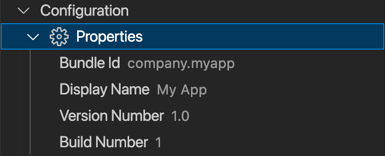

Your native project's version, bundle identifier, and display name can be easily read and changed.

import Video from '../../../components/video.astro';

<Video src="https://videos.webnative.dev/native-settings.mp4" alt="Native Settings" controls />

Click `Configuration` > `Properties` to change:

- **Display name** - The name shown underneath the icon on the home screen.
- **Bundle identifier** - The unique identifier for your application.
- **Version number** - The major and minor version number (e.g., `2.5`).
- **Build number** - The build number usually associated with the version number (e.g., `3`).

:::note
When changing one of these properties both `ios` and `android` native projects will be changed.
:::
