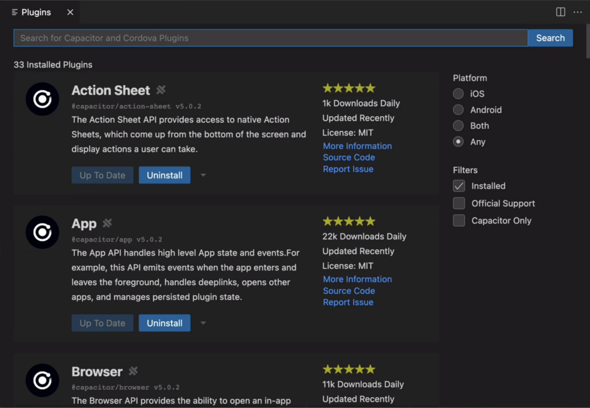

Plugins provide Capacitor with great native features, so finding high quality plugins is an important part of implementing features in your app.

## Finding Plugins

To find a plugin, press `F1` and type `plugins` or click the `...` next to `Plugins` from the extension.

Type a keyword, feature, or part of the name of a plugin and press `enter` or click `Search` to display the list of matching plugins. 

## Installing Other Packages
You may need to install a dependency that is not a plugin. If your search is an exact match for an NPM package then it will also show (eg try `angularx-qrcode`). You can then click `Install` to add that dependency to your project.

## About the Plugin List
Around 1100 plugins are indexed daily. This list comes from the most popular Capacitor and Cordova plugins that are used in projects. You can contribute to this list by filing an Issue or PR to the [repo](https://github.com/ionic-team/capacitor-plugin-registry).

### Plugin Ratings
The star rating for a plugin is automatically calculated based on the [NPM](https://www.npmjs.com/) and GitHub statistics for the plugin project:
1. Is the plugin's project open source?
2. Are there at least 100 Github stars?
3. Has the plugin been published to npm in the last year?
4. Is the version considered stable? (ie version 0.x)
5. Are there at least 1000 downloads on npm per month?

The goal of the rating system is to highlight projects that are regularly used, maintained and liked by the community. 

### Tips

- You can choose a particular version of a plugin to install by clicking the down arrow (↓).
- Clicking `install` or `update` will install the latest version of the plugin that works with your project.
- The `More Information` link will open a browser to the listing in NPM or to official documentation.
- The `Source Code` link will open a browser showing the Github project.
- The `Report Issue` link will link to where a plugin author wants you to file issues.
- Cordova plugins will show the Cordova logo, Capacitor plugins show the Capacitor logo.
- If a plugin targets only Android, or only iOS then an Android or Apple logo will show next to it.
- If you are using the latest version of a plugin you may see `Up To Date`. Plugins are checked daily so its possible that a plugin released today may still show `Up To Date`.

### Plugin Authors

To ensure your plugin looks great by ensuring your `package.json` meets these requirements before publishing to npm:
1. Provide a list of appropriate keywords that a user may search for in the `keywords` property.
1. Provide a good description of what the plugin does in the `description` property.
1. Be sure to specify an appropriate license type in the `license` property (eg `MIT`,`Apache-2.0`, `BSD`) .
1. Set to the Github repo url `repository` > `url` property.
1. Set the url to where to file issues in the `bugs` > `url` property.
1. Be sure to set the author's name in the `author` property (eg `author: { name: 'John Smith'}`).

### Other Tips
- Use an avatar in your Github project that matches your plugin function or company.
- Avoid using a 0.x version number unless you are in beta.
- Avoid keyword stuffing (eg using keywords like `plugin` or terms unrelated to your plugin). These are automatically excluded during indexing.
- Forks of existing maintained plugins may be excluded.
