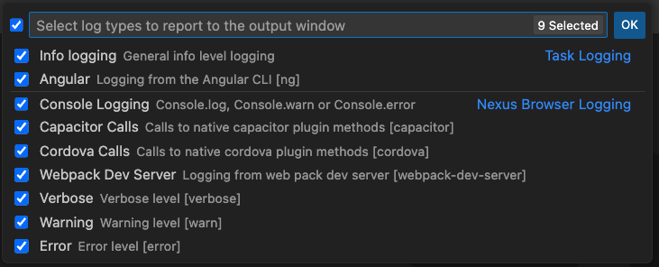

The WebNative app detects and displays Capacitor apps launched from the WebNative VS Code Extension (click `Run` > `Web`).

You can download the WebNative app from the [App Store](https://apps.apple.com/us/app/nexus-browser/id6445866986) or the [Play Store](https://play.google.com/store/apps/details?id=com.nexusconcepts.nexus).

import Video from '../../../components/video.astro';

<Video src="https://videos.webnative.dev/webnative-app.mp4" alt="WebNative App" controls />

## How it works

When you run your web application it will be served on your local network. The WebNative app will detect this and launch your application in the mobile app.

Your computer and mobile device must be on the same WIFI network. Your dev server should be serving on an external IP address.

You can run the app on multiple devices at the same time.

### Console Logs

Whenever you `console.log` in your code this will be sent from the WebNative app to the `Output` window in VS Code. You can control what is logged by clicking `Advanced` > `Logging`:

### Preinstalled Plugins
The WebNative app comes pre-installed with plugins like `@capacitor/geolocation` and `@capacitor/barcode-scanner` as well as [35 other plugins](https://webnative.app/capacitor) that allow you to use native mobile functionality.

### Open Source
The Webnative mobile app is open source and can be found on [GitHub](https://github.com/damiant/webnative-app). You can report [issues or feature requests](https://github.com/damiant/webnative-app/issues).