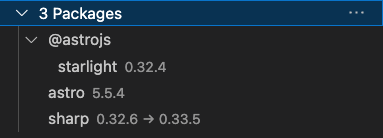

Keeping your dependencies up to date will ensure you are using supported and [secure](#security-vulnerabilities) products. Ignoring updates will increase your technical debt making it harder to update in the future. 

## Updating One Dependency

Click `Packages` to show all dependencies showing their current version and their latest version.

Click a Dependency and Choose:
- `Upgrade` to upgrade the dependency to the latest version.
- `Info` to display the npm web page for this dependency.
- `Uninstall` to remove the dependency from the project.

Some dependencies that require additional migration steps may be done automatically for you. For example: updating `@ionic/angular-toolkit` will migrate `angular.json` to remove unneeded sections or add `@ionic/cordova-builders` for Cordova projects.

:::tip
Hover over any dependency and click the `...` to show all available versions you can install for that dependency.
:::

## Updating Multiple Dependencies

Packages are grouped under a scope (for example `@ionic`, `@capacitor`). You can upgrade all dependencies in a scope by clicking on the 💡 icon.

## Minor Updates

You can see all available minor updates (eg from `1.2.0` > `1.3.1`) for your project by clicking `Configuration` > `Check for Minor Updates`.

Choosing to upgrade will update each item one at a time.

## Security Vulnerabilities

Click `Configuration` > `Security Audit` to identify all dependencies that have a security vulnerability. You can choose to attempt to fix these.

:::note
This feature uses `npm audit`. When attempting to fix dependencies it uses `npm audit fix` which may not be able to resolve all issues. You may need to update dependencies to later versions to resolve a security vulnerability.
:::