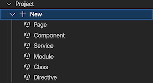

The extension has additional features for [Angular](https://angular.dev/) projects.

## Updating Angular

For Angular projects, click `Packages` > `@Angular` to update to the latest minor version, or migrate to the next major version of Angular. The `ng migrate` feature will be used to migrate your project.

## New Angular Items

Select `Project` > `+ New` to create Angular Components, Services, Modules, Classes, Directives and Ionic Pages.

## Migrations

For Angular migrations click `...` next to `Project` and choose from:

- **Migrate to Signal Inputs** - This refactors all `@Input()` decorators to [signal inputs](https://angular.dev/guide/components/inputs).
- **Migrate to Built In Control Flow Syntax** - This refactors directives like `*ngFor` to `@for`.
- **Migrate to replace @Output with Output functions** - Refactors out `@Output` directives.
- **Migrate to use inject for dependency injection** - Refactors constructors declaring dependencies to use `inject`.
- **Migrate ViewChild and ContentChild to use signals** - Refactors these directives.
- **Migrate to Ionic Standalone Components** - Refactors to use standalone components for Ionic rather than Modules.
- **Switch from WebPack to ESBuild** - Your Angular project will be switched to use the ESBuild option.

#### Use HTTPS

Angular projects can be run on a development web server that uses HTTPS by clicking `Settings` > `Use HTTPS`. More information can be found [here](../../capacitor/build-and-run#using-https).