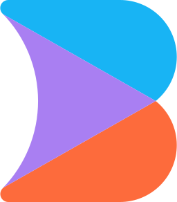
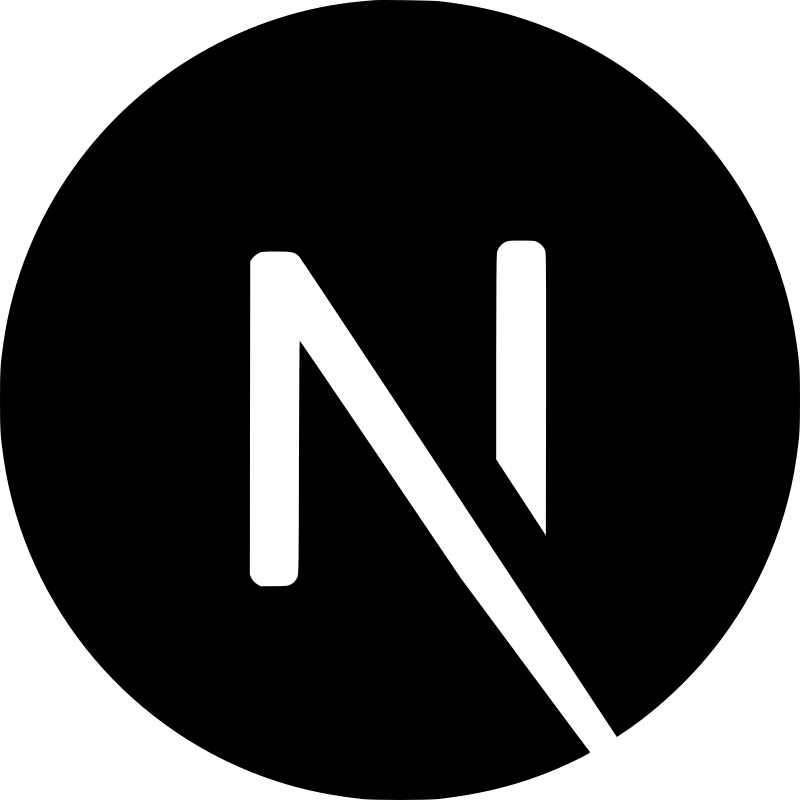

import { Card, CardGrid, LinkCard } from "@astrojs/starlight/components";

Support is available for the following frameworks for new project starters, running, debugging and previewing.

  - Astro
  - Angular
  - Builder
  - Hydrogen
  - Ionic
  - Lit
  - NextJS
  - Nuxt
  - Preact
  - Qwik
  - Solid
  - Svelte
  - TanStack
  - Vite
  - Vue
  - Waku

